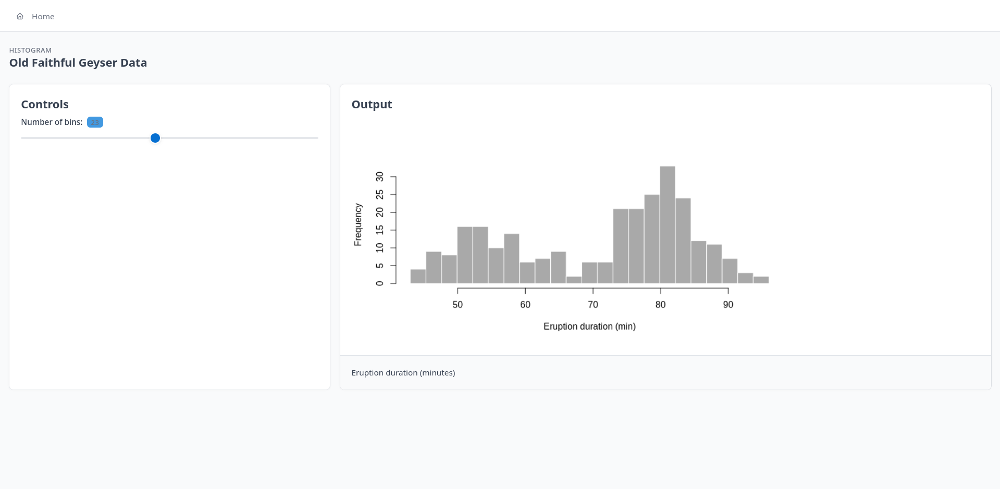

<!-- README.md is generated from README.Rmd. Please edit that file -->

<!-- badges: start -->

[](https://lifecycle.r-lib.org/articles/stages.html#stable)
[](https://github.com/pachadotdev/tabler/actions/workflows/R-CMD-check.yaml)
[](https://CRAN.R-project.org/package=cpp4r)
[](https://github.com/pachadotdev/tabler/actions/workflows/test-coverage.yaml)
[](https://buymeacoffee.com/pacha)
<!-- badges: end -->

# Tabler for R

A modern dashboard framework for R using the beautiful Tabler Bootstrap theme. To render Tabler apps using a server, see [Tabler Server](https://github.com/pachadotdev/tabler-server).

<iframe width="560" height="315" src="https://www.youtube.com/embed/_PWVmmis-AE?si=wJYMvUQUpoZz_k3_" title="YouTube video player" frameborder="0" allow="accelerometer; autoplay; clipboard-write; encrypted-media; gyroscope; picture-in-picture; web-share" referrerpolicy="strict-origin-when-cross-origin" allowfullscreen>

</iframe>

## Installation

Old version, depends on Shiny:

```r
install.packages("tabler", repos = "https://cran.r-project.org")
```

New version, does not use Shiny:

```r
# using the R-Universe
install.packages("tabler", repos = "https://pachadotdev.r-universe.dev")

# or using the remotes package
remotes::install_github("pachadotdev/tabler")
```

## Quick Start

Please see the documentation: <https://pacha.dev/tabler/>.

The following chunk uses the "fluid" layout to recreate Shiny's geyser example.

<figure>

<figcaption aria-hidden="true">layout-geyser</figcaption>
</figure>

```r
library(tabler)

ui <- page(
  layout = "fluid",
  title  = "Old Faithful Geyser Data",
  navbar = navbar_menu(
    menu_item("Home", icon = "home")
  ),
  body = list(
    header(title = "Old Faithful Geyser Data", subtitle = "Histogram"),
    body(
      column(
        4,
        card(
          title = "Controls",
          sliderInput("bins", "Number of bins:", min = 1, max = 50, value = 30)
        )
      ),
      column(
        8,
        card(
          title  = "Output",
          footer = "Eruption duration (minutes)",
          plotOutput("distPlot")
        )
      )
    )
  )
)

server <- function(input, output, session) {
  output$distPlot <- renderPlot({
    x    <- faithful[, 2]
    bins <- seq(min(x), max(x), length.out = input$bins + 1)
    x |>
      hist(
        breaks = bins,
        col    = "darkgray",
        border = "white",
        main   = NULL,
        xlab   = "Eruption duration (min)"
      )
  })
}

tablerApp(ui, server)
```

## Available Layouts

I added [full examples](https://github.com/pachadotdev/tabler/tree/main/examples) for each of the following layouts:

- **Boxed (Default)**: Basic dashboard with top navbar and constrained
  width content area. This is the default layout.
- **Combo**: Combines vertical sidebar navigation with top header.
- **Condensed**: Compact layout with reduced padding/margins.
- **Fluid**: Full-width layout without container constraints.
- **Fluid Vertical**: Full-width layout with vertical sidebar.
- **Horizontal**: Layout with horizontal navigation menu.
- **Navbar Dark**: Layout with dark navbar theme.
- **Navbar Overlap**: Layout where content overlaps with navbar for a
  modern look.
- **Navbar Sticky**: Layout with sticky/fixed navbar that stays at the
  top when scrolling.
- **RTL**: Right-to-left layout for Hebrew/Arabic languages.
- **Vertical**: Vertical sidebar layout without top navbar.
- **Vertical Right**: Vertical sidebar positioned on the right side.
- **Vertical Transparent**: Vertical layout with transparent sidebar.

## Differences with Shiny

- Static plots (base, ggplot, tinyplot, etc.) render as SVG and can be downloaded with the right click button.
- URLs are of the form `my.site/myapp?year=2000&country=gbr` instead of `my.site/myapp?year=2000&country=%22gbr%22` 

## License

Apache License (\>= 2)
