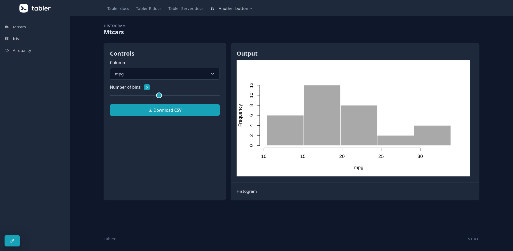
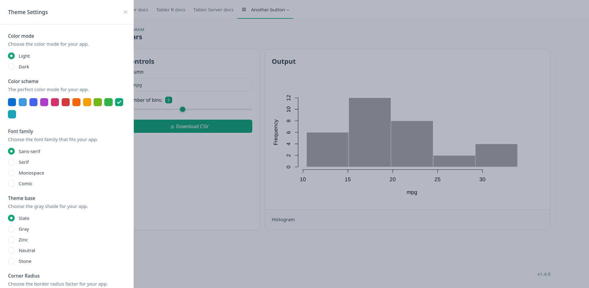

# Tabler for R

<!-- badges: start -->
[](https://lifecycle.r-lib.org/articles/stages.html#stable)
[](https://github.com/pachadotdev/tabler/actions/workflows/R-CMD-check.yaml)
[](https://CRAN.R-project.org/package=tabler)
[](https://github.com/pachadotdev/tabler/actions/workflows/test-coverage.yaml)
[](https://buymeacoffee.com/pacha)
<!-- badges: end -->

A modern dashboard framework for R using the beautiful Tabler Bootstrap theme. To render Tabler apps using a server, see [Tabler Server](https://github.com/pachadotdev/tabler-server).

<iframe width="560" height="315" src="https://www.youtube.com/embed/_PWVmmis-AE?si=wJYMvUQUpoZz_k3_" title="YouTube video player" frameborder="0" allow="accelerometer; autoplay; clipboard-write; encrypted-media; gyroscope; picture-in-picture; web-share" referrerpolicy="strict-origin-when-cross-origin" allowfullscreen>

</iframe>

## Installation

Old version, depends on Shiny:

```r
install.packages("tabler", repos = "https://cran.r-project.org")
```

New version, does not use Shiny:

```r
# using the R-Universe
install.packages("tabler", repos = "https://pachadotdev.r-universe.dev")

# or using the remotes package
remotes::install_github("pachadotdev/tabler")
```

## Quick Start

### Single-script app

The following example uses the "combo" layout to recreate Shiny's geyser example. The theme options
can be adjusted from the code or the theme setting icon that can be hidden. See the example
[here](https://github.com/pachadotdev/tabler/blob/main/inst/extdata/app-template/combo-layout.R).

<figure>

</figure>

<figure>

</figure>

<figure>

</figure>

### Modular R package app

Create an R package with modular components:

```
library(tabler)

pkg_template("mydashboard")
```

See the package skeleton [here](https://github.com/pachadotdev/tabler/tree/main/inst/extdata/pkg-template). `pkg_template()` adds a `DESCRIPTION` and other components required for an R package to work.

I built a full dashboard that uses environment variables, SQL connections, caching, and D3 plots [here](https://github.com/pachadotdev/tradestatistics-dashboard).

## Available Layouts

There are [additional examples](https://github.com/pachadotdev/tabler/tree/main/examples) for each of the following layouts:

- **Boxed (Default)**: Basic dashboard with top navbar and constrained
  width content area. This is the default layout.
- **Combo**: Combines vertical sidebar navigation with top header.
- **Condensed**: Compact layout with reduced padding/margins.
- **Fluid**: Full-width layout without container constraints.
- **Fluid Vertical**: Full-width layout with vertical sidebar.
- **Horizontal**: Layout with horizontal navigation menu.
- **Navbar Dark**: Layout with dark navbar theme.
- **Navbar Overlap**: Layout where content overlaps with navbar for a
  modern look.
- **Navbar Sticky**: Layout with sticky/fixed navbar that stays at the
  top when scrolling.
- **RTL**: Right-to-left layout for Hebrew/Arabic languages.
- **Vertical**: Vertical sidebar layout without top navbar.
- **Vertical Right**: Vertical sidebar positioned on the right side.
- **Vertical Transparent**: Vertical layout with transparent sidebar.

Note: `tabler` allows to pass `layout = "navbar"` and `layout = "navbar-sticky-dark"` which are wrappers
for a light theme navbar layout and a dark theme sticky navbar layour, respectively.

## Differences with Shiny

- Static plots (base, ggplot, tinyplot, etc.) render as SVG and can be downloaded with the right click button.
- URLs are of the form `my.site/myapp?year=2000&country=gbr` instead of `my.site/myapp?year=2000&country=%22gbr%22` 

## License

Apache License (\>= 2)
